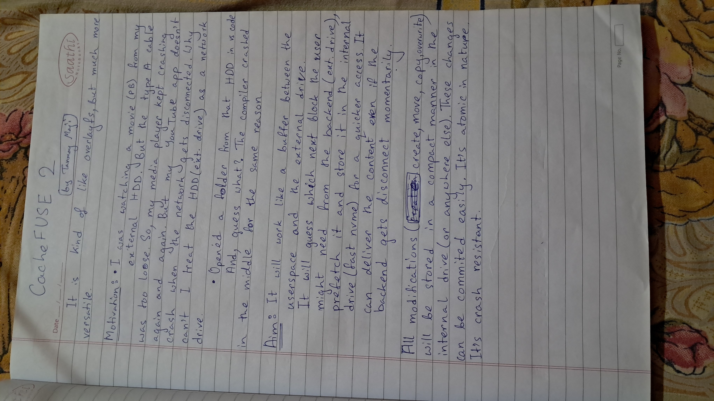
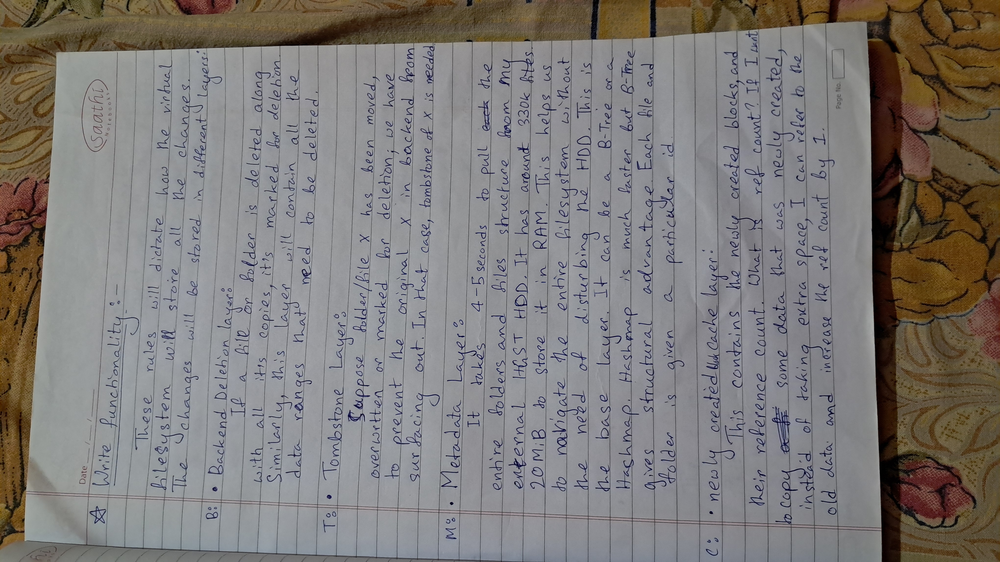
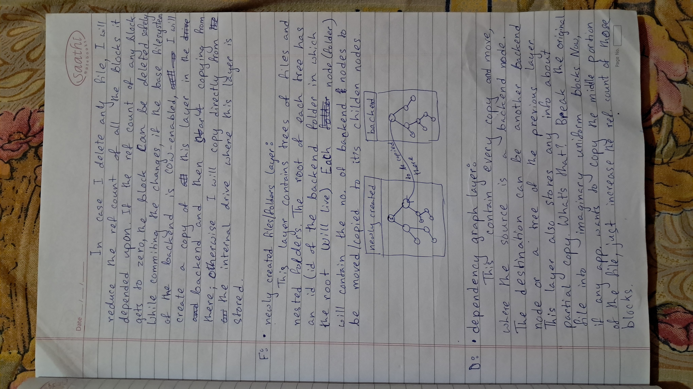
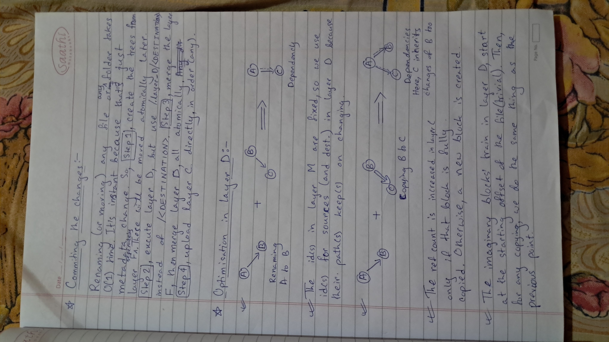
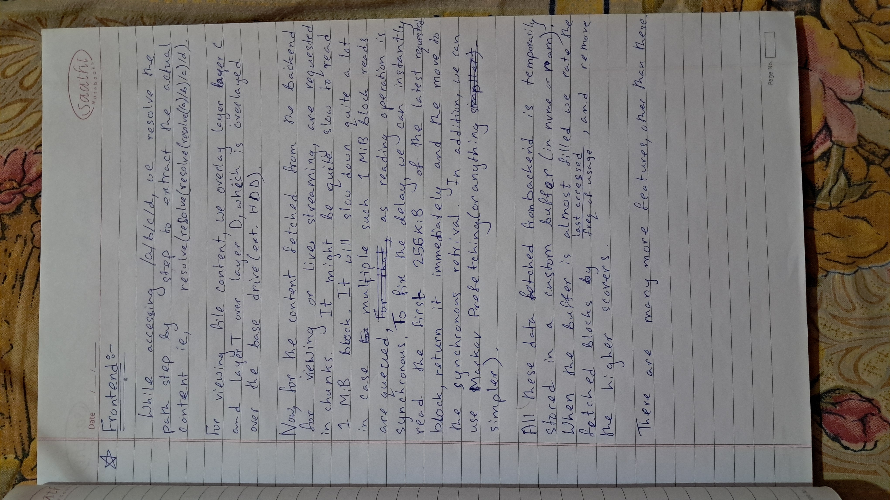

# Mantle

Mantle is a fault-tolerant, hybrid overlay file system that brings network-stream resilience and Copy-on-Write (CoW) semantics to standard block storage. It acts as a crucial layer between the user and volatile hardware, preventing application hangs, kernel panics, and crashes caused by unreliable backends like loose USB cables or spotty network connections.

---

## Core Advantages

* **Hardware Agnostic**: Mantle does not require cloud infrastructure and functions as an overlay for any arbitrary POSIX or block device. Users can reliably mount a flaky Wi-Fi hard drive, a spotty SMB network share, or a loose USB-C external drive.
* **Extreme Offline Mutability**: Users can unplug their drive, reorganize thousands of files, and continue working seamlessly for hours offline. These complex reorganization operations are recorded as pure mathematical changes in a Directed Acyclic Graph (DAG).
* **Zero Vendor Lock-in**: Data remains in its native, raw format on the base drive. When commits are made to the backend, they are written as standard files to standard file systems like Ext4, NTFS, or APFS.
* **Self-Sovereign and Cost-Effective**: Mantle runs entirely on the user's local compute without enforcing monthly cloud storage tolls or ingress/egress fees.

---

## Multi-Layered Architecture

Mantle breaks down data management into highly modular, specialized layers to decouple userspace requests from physical hardware limits. 

### Layer M (Metadata)
This is the base RAM layer built as a B-Tree or Hashmap. It takes 4-5 seconds to pull the full directory structure (e.g., 330k files into 20 MiB of RAM) and assigns a fixed ID to every file and folder. 

### Layer F (New Files/Folders)
This layer handles pure structure. It stores the metadata trees for newly created files and nested folders, pointing back to the ID of the backend folder they will eventually live in.

### Layer C (New Block Cache)
This layer handles the actual data. It contains the physical blocks of newly created data and tracks their reference counts to ensure no space is wasted if data is copied.

### Layer B (Backend Deletion)
This layer acts as a permanent ledger. It stores the specific data ranges and files that are marked to be physically deleted from the backend drive during a commit.

### Layer T (Tombstone)
This layer acts as a live mask. If a file is moved, overwritten, or marked for deletion, Layer T prevents the original backend version of that file from surfacing to the user in the live view.

### Layer D (Dependency Graph)
This layer handles movement and partial copies. It uses the fixed IDs from Layer M to track operations mathematically, optimizes redundant paths, and handles partial copies by incrementing the reference count of "imaginary blocks".

---

## Deep Dive: Mechanical Operations

Mantle relies on strict spatial and sequential mechanics to process complex operations safely.

### Frontend Overlay Logic (The Read Path)
When an application requests a file, the frontend resolves it by stacking the layers in a precise, non-destructive order:
1. **Layer C** and **Layer T** are overlaid on top of...
2. **Layer D**, which is overlaid on top of...
3. **The Base Drive**.

### DAG Path Optimization
Because everything relies on fixed IDs in Layer M, changing a path is a pure metadata operation. Path optimization within Layer D resolves redundant I/O operations before they reach the backend. 
* *Example:* If a user renames/moves file `A` to `B`, and later moves `B` to `C`, the graph resolves this directly as `A -> C`. The intermediate `B` operation is never queued for the final commit.

### Imaginary Blocks (Partial Copies)
Mantle handles partial file copies efficiently to maximize storage on fast NVMe cache drives. When an application attempts to copy the middle portion of a file, Mantle splits the original file into uniform "imaginary blocks." Instead of creating new physical data, it simply increments the reference count of those overlapping blocks in Layer C.

---

## The 4-Step Commit Process

Mantle ensures data integrity by executing backend commits through a rigid, atomic sequence. It does not blindly flush data; it orchestrates the metadata and structure first.

1. **Step 1**: Create the structural trees from Layer F atomically.
2. **Step 2**: Execute Layer D (resolving all DAG dependencies).
3. **Step 3**: Merge Layer F, then merge Layer D atomically.
4. **Step 4**: Upload Layer C directly in any order.

---

## Read Pipeline & UX Optimizations

To prevent stuttering and I/O timeouts, Mantle utilizes an optimized read pipeline and smart memory management.

* **Asynchronous Chunking**: The system serves a 256 KiB chunk immediately while fetching the rest of a 1 MiB block in the background. This keeps media players fed and turns flaky remote connections into a smooth local experience.
* **Eviction Policy**: Mantle uses a custom buffer eviction formula that acts as a hybrid of Least Recently Used (LRU) and Least Frequently Used (LFU).
* **Scoring Mechanism**: Blocks with a high time delta and low frequency yield the highest score, correctly marking them for removal. The scoring equation is defined as:

$$\text{Score} = \frac{\text{Time Since Last Accessed}}{\text{Frequency of Usage}}$$

---

## Technical Considerations & Edge Cases

* **Split-Brain / Stale State**: If the base drive is disconnected, modified elsewhere, and reconnected, Layer M's snapshot will be out of sync. Fast validation checks (like hashing directory modification times) are required before committing Layer D.
* **Memory Spikes on Deep Resolution**: The read path traversing through Layer C, T, D, and the Base can cause latency on heavily modified, deeply nested files. Flattening Layer D periodically prevents these latency spikes.
* **Commit Atomicity**: A rollback mechanism or journal is required to ensure the backend isn't corrupted if a power failure occurs exactly between merging structure (Step 3) and uploading raw data (Step 4).

---

## Real-World Use Cases

| Industry | Problem Solved |
| :--- | :--- |
| **Video & Audio Production** | Prevents timeline stuttering and application crashes when working with massive 4K/8K ProRes files over a NAS or Thunderbolt connection. |
| **Developer Environments** | Allows IDEs to scan, index, and search massive repositories at the speed of RAM by pulling the directory tree into Layer M. |
| **Cloud Gaming & Streaming** | Prevents synchronous block fetching stutter when streaming large binary blobs by utilizing prefetching and LFU/LRU eviction logic. |
| **Edge Computing & IoT** | Enables devices to write files and build dependency graphs while disconnected, safely flushing the state to the backend once a connection is re-established. |
---

## Appendix: Original Planning

